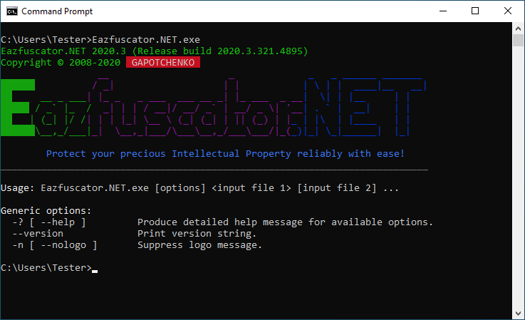

# Gapotchenko.FX.Console

[](../../LICENSE)
[](https://www.nuget.org/packages/Gapotchenko.FX.Console)

The module provides virtual terminal functionality, console traits and useful primitives for console apps.

## Virtual Terminal

From the very beginning, computers used to employ [teletypes](https://en.wikipedia.org/wiki/Teleprinter) as primary input/output devices.
A teletype usually consisted of a keyboard and printer in a single box.

At later stages of development, teletypes were swapped with specialized computer terminals such as [VT100](https://en.wikipedia.org/wiki/VT100).
Those electronic devices provided not only basic input/output capabilities,
but also colors, pseudographics, and a custom control language based around a then-emerging [ANSI X3.64](https://en.wikipedia.org/wiki/ANSI_escape_code) standard.

Unix operating systems have built-in support of ANSI escape sequences that constitute the control language defined by the standard. Windows ignored that practice for a long time, up until Windows 10 version 1511.

### What ANSI Escape Sequences Are Useful For?

Indeed, .NET base class library already provides
[`ForegroundColor`](https://docs.microsoft.com/en-us/dotnet/api/system.console.foregroundcolor),
[`BackroundColor`](https://docs.microsoft.com/en-us/dotnet/api/system.console.backgroundcolor)
and other properties of [`System.Console`](https://docs.microsoft.com/en-us/dotnet/api/system.console) class
for controlling the console output.

ANSI escape sequences become handy when the complexity of console output reaches a certain level:



It would be a very *involved* code to render such an output with a set of imperative calls.

But we can do better with [ANSI escape sequences](https://docs.microsoft.com/en-us/windows/console/console-virtual-terminal-sequences):

```csharp
using Gapotchenko.FX.Console;
using System;

VirtualTerminal.EnableProcessing();

Console.WriteLine(
    "                 \x1b[35m__                     _             \x1b[34m_   _ ______ _______ \n" +
    "\x1b[42;32m██████\x1b[49m         \x1b[35m / _|                   | |           \x1b[34m| \\ | |  ____|__   __|\n" +
    "\x1b[42;32m██\x1b[49m     __ _ ___\x1b[35m| |_ _   _ ___  ___ __ _| |_ ___  _ __\x1b[34m|  \\| | |__     | |   \n" +
    "\x1b[42;32m█████\x1b[49m / _` |_  /\x1b[35m  _| | | / __|/ __/ _` | __/ _ \\| '__\x1b[34m| . ` |  __|    | |   \n" +
    "\x1b[42;32m██\x1b[49m   | (_| |/ /\x1b[35m| | | |_| \\__ \\ (_| (_| | || (_) | |\x1b[34m_ | |\\  | |____   | |   \n" +
    "\x1b[42;32m██████\x1b[49m\\__,_/___|\x1b[35m_|  \\__,_|___/\\___\\__,_/___\\___/|_(\x1b[34m_)|_| \\_|______|  |_|\x1b[0m");
```

Please note that the implementation starts with a call of `VirtualTerminal.EnableProcessing` method.
It is provided by `Gapotchenko.FX.Console` module and ensures that support of ANSI escape sequences is activated for the console.
In case when the host OS does not provide a native support for them, the method switches to a virtual terminal emulation.

In this way, ANSI X3.64 control language is guaranteed to work on the widest range of host operating systems.

## Console Traits

## MoreTextWriter for Paginated Output

## Usage

`Gapotchenko.FX.Console` module is available as a [NuGet package](https://nuget.org/packages/Gapotchenko.FX.Console):

```
PM> Install-Package Gapotchenko.FX.Console
```

## Other Modules

Let's continue with a look at some other modules provided by Gapotchenko.FX:

- [Gapotchenko.FX](../Gapotchenko.FX)
- [Gapotchenko.FX.AppModel.Information](../Gapotchenko.FX.AppModel.Information)
- [Gapotchenko.FX.Collections](../Gapotchenko.FX.Collections)
- &#x27B4; [Gapotchenko.FX.Console](../Gapotchenko.FX.Console)
- [Gapotchenko.FX.Diagnostics](../Gapotchenko.FX.Diagnostics.CommandLine)
- [Gapotchenko.FX.IO](../Gapotchenko.FX.IO)
- [Gapotchenko.FX.Linq](../Gapotchenko.FX.Linq)
- [Gapotchenko.FX.Math](../Gapotchenko.FX.Math)
- [Gapotchenko.FX.Text](../Gapotchenko.FX.Text)
- [Gapotchenko.FX.Threading](../Gapotchenko.FX.Threading)

Or look at the [full list of modules](..#available-modules).
