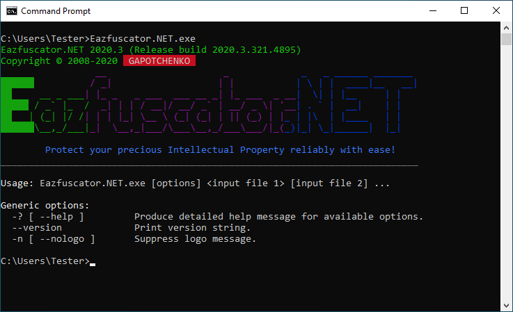
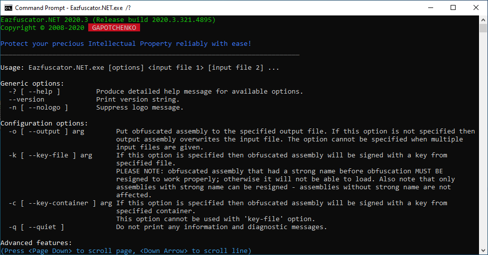
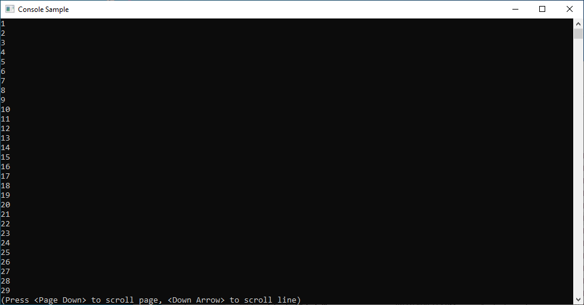

# Gapotchenko.FX.Console

[](../../../../LICENSE)
[](https://www.nuget.org/packages/Gapotchenko.FX.Console)

The module provides virtual terminal functionality, console traits, and other useful primitives for .NET console apps.

## Virtual Terminal

From the very beginning, computers used to employ [teletypes](https://en.wikipedia.org/wiki/Teleprinter) as primary input and output devices.
A teletype usually consisted of a keyboard and a printer, both placed inside a single case.

At later stages of development, teletypes were swapped with specialized computer terminals such as [VT100](https://en.wikipedia.org/wiki/VT100).
Those electronic devices provided not only the basic input/output capabilities,
but also colors, pseudographics, and a custom control language based around a then-emerging [ANSI X3.64](https://en.wikipedia.org/wiki/ANSI_escape_code) standard.

Unix operating systems have a built-in support for ANSI escape sequences that constitute the control language defined by the standard. Windows ignored that practice for a long time, up until Windows 10 version 1511.

### What ANSI Escape Sequences Are Useful For?

Indeed, .NET base class library already provides
[`System.Console`](https://docs.microsoft.com/en-us/dotnet/api/system.console) class with
[`ForegroundColor`](https://docs.microsoft.com/en-us/dotnet/api/system.console.foregroundcolor),
[`BackroundColor`](https://docs.microsoft.com/en-us/dotnet/api/system.console.backgroundcolor)
and other properties for controlling the console.

ANSI escape sequences become handy when the complexity of console output reaches a certain level. Just take a look at the example below:



It would be a very *involved* code to render such output with a set of imperative calls.

But we can do better with [ANSI escape sequences](https://docs.microsoft.com/en-us/windows/console/console-virtual-terminal-sequences):

``` C#
using Gapotchenko.FX.Console;
using System;

VirtualTerminal.EnableProcessing();

Console.WriteLine(
    "                 \x1b[35m__                     _             \x1b[34m_   _ ______ _______ \n" +
    "\x1b[42;32m██████\x1b[49m         \x1b[35m / _|                   | |           \x1b[34m| \\ | |  ____|__   __|\n" +
    "\x1b[42;32m██\x1b[49m     __ _ ___\x1b[35m| |_ _   _ ___  ___ __ _| |_ ___  _ __\x1b[34m|  \\| | |__     | |   \n" +
    "\x1b[42;32m█████\x1b[49m / _` |_  /\x1b[35m  _| | | / __|/ __/ _` | __/ _ \\| '__\x1b[34m| . ` |  __|    | |   \n" +
    "\x1b[42;32m██\x1b[49m   | (_| |/ /\x1b[35m| | | |_| \\__ \\ (_| (_| | || (_) | |\x1b[34m_ | |\\  | |____   | |   \n" +
    "\x1b[42;32m██████\x1b[49m\\__,_/___|\x1b[35m_|  \\__,_|___/\\___\\__,_/___\\___/|_(\x1b[34m_)|_| \\_|______|  |_|\x1b[0m");
```

Please note that the implementation starts with a call to `VirtualTerminal.EnableProcessing` method.
It is provided by `Gapotchenko.FX.Console` module and ensures that support of ANSI escape sequences is activated for the console.
In case when the host OS does not provide a native support for them, the method switches to a virtual terminal emulation.

In this way, ANSI X3.64 control language is guaranteed to work on the widest range of host operating systems and terminals.

## Console Traits

`Gapotchenko.FX.Console` module provides `ConsoleTraits` class that allows you to programmatically retrieve the current console capabilities.

### IsColorAvailable

`ConsoleTraits.IsColorAvailable` boolean property indicates whether console color output is available.
Console color is usually always available unless program standard output streams are redirected.

### IsColorInhibited

`ConsoleTraits.IsColorInhibited` boolean property indicates whether console color output is inhibited.

Console color may be inhibited by the host system or a user preference.
For example, a `NO_COLOR` environment variable can be used to inhibit console colors as described by the corresponding [specification](https://no-color.org/).

### IsColorEnabled

`ConsoleTraits.IsColorEnabled` boolean property indicates whether console color output is enabled.
The console color is enabled when it is available and not inhibited.

The value of the property can be used by a program to automatically tune the output according to the usage context and user preference.
Like so:

``` C#
if (ConsoleTraits.IsColorEnabled)
{
    Console.WriteLine(
        "                 \x1b[35m__                     _             \x1b[34m_   _ ______ _______ \n" +
        "\x1b[42;32m██████\x1b[49m         \x1b[35m / _|                   | |           \x1b[34m| \\ | |  ____|__   __|\n" +
        "\x1b[42;32m██\x1b[49m     __ _ ___\x1b[35m| |_ _   _ ___  ___ __ _| |_ ___  _ __\x1b[34m|  \\| | |__     | |   \n" +
        "\x1b[42;32m█████\x1b[49m / _` |_  /\x1b[35m  _| | | / __|/ __/ _` | __/ _ \\| '__\x1b[34m| . ` |  __|    | |   \n" +
        "\x1b[42;32m██\x1b[49m   | (_| |/ /\x1b[35m| | | |_| \\__ \\ (_| (_| | || (_) | |\x1b[34m_ | |\\  | |____   | |   \n" +
        "\x1b[42;32m██████\x1b[49m\\__,_/___|\x1b[35m_|  \\__,_|___/\\___\\__,_/___\\___/|_(\x1b[34m_)|_| \\_|______|  |_|\x1b[0m");
}
else
{
    Console.WriteLine(
@" ______           __                     _             _   _ ______ _______ 
|  ____|         / _|                   | |           | \ | |  ____|__   __|
| |__   __ _ ___| |_ _   _ ___  ___ __ _| |_ ___  _ __|  \| | |__     | |   
|  __| / _` |_  /  _| | | / __|/ __/ _` | __/ _ \| '__| . ` |  __|    | |   
| |___| (_| |/ /| | | |_| \__ \ (_| (_| | || (_) | |_ | |\  | |____   | |   
|______\__,_/___|_|  \__,_|___/\___\__,_/___\___/|_(_)|_| \_|______|  |_|");
}
```

This is important in situations when the color output is not available.
For example, console output redirection inhibits color by default.
So the code above will produce slightly different outputs depending on whether the console output is written to the color screen or redirected to a file which has no notion of a color at all.

### WillDisappearOnExit

`ConsoleTraits.WillDisappearOnExit` boolean property indicates whether a console window will immediately disappear on a program exit.
Such a situation can occur when a console app is directly launched from a graphical shell.
In Windows, you can achieve that by creating a desktop shortcut to a console app and then running it.

A program can use the value of `WillDisappearOnExit` property to hold the console window in a visible state so that the user could read the output.
Like so:

``` C#
if (ConsoleTraits.WillDisappearOnExit)
{
    Console.WriteLine();
    Console.WriteLine("Press any key to exit . . .");
    Console.ReadKey(true);
}
```

## `MoreTextWriter` for Paginated Output

`MoreTextWriter` class from `Gapotchenko.FX.Console` module automatically manages pagination when written text exceeds the height of a console area visible to the user.

The functionality is similar to `more` command-line utility but can be used right within a program.
This allows you to provide an additional convenience for end users.

Let's take a look on example:



By pressing `Page Down` and `Down Arrow` keys it is possible to scroll the console output.
The standard `Space` and `Enter` are supported as well.

Below is a simple program that demonstrates the use of `MoreTextWriter`:

``` C#
using Gapotchenko.FX.Console;
using System;

var more = new MoreTextWriter(Console.Out);

for (int i = 1; i < 100; ++i)
    more.WriteLine(i);
```

It produces the following output:



The keys, colors, and styling are fully customizable by deriving a class from the `MoreTextWriter`.

## Usage

`Gapotchenko.FX.Console` module is available as a [NuGet package](https://nuget.org/packages/Gapotchenko.FX.Console):

```
PM> Install-Package Gapotchenko.FX.Console
```

## Other Modules

Let's continue with a look at some other modules provided by Gapotchenko.FX:

- [Gapotchenko.FX](../Gapotchenko.FX#readme)
- [Gapotchenko.FX.AppModel.Information](../AppModel/Gapotchenko.FX.AppModel.Information#readme)
- [Gapotchenko.FX.Collections](../Gapotchenko.FX.Collections#readme)
- &#x27B4; [Gapotchenko.FX.Console](.#readme)
- [Gapotchenko.FX.Data](../Data/Encoding/Gapotchenko.FX.Data.Encoding#readme)
- [Gapotchenko.FX.Diagnostics](../Diagnostics/Gapotchenko.FX.Diagnostics.CommandLine#readme)
- [Gapotchenko.FX.IO](../Gapotchenko.FX.IO#readme)
- [Gapotchenko.FX.Linq](../Linq/Gapotchenko.FX.Linq#readme)
- [Gapotchenko.FX.Math](../Math/Gapotchenko.FX.Math#readme)
- [Gapotchenko.FX.Memory](../Gapotchenko.FX.Memory#readme)
- [Gapotchenko.FX.Security.Cryptography](../Security/Gapotchenko.FX.Security.Cryptography#readme)
- [Gapotchenko.FX.Text](../Gapotchenko.FX.Text#readme)
- [Gapotchenko.FX.Threading](../Gapotchenko.FX.Threading#readme)
- [Gapotchenko.FX.Tuples](../Gapotchenko.FX.Tuples#readme)

Or look at the [full list of modules](../../..#readme).
